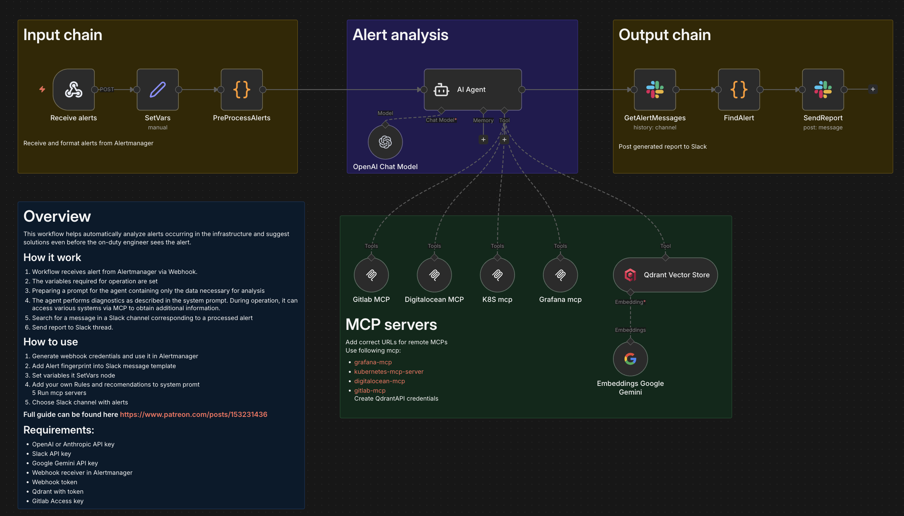

# Overview

This workflow helps automatically analyze alerts occurring in the infrastructure and suggest solutions even before the on-duty engineer sees the alert.

## How it work
1. Workflow receives alert from Alertmanager via Webhook.
2. The variables required for operation are set
3. Preparing a prompt for the agent containing only the data necessary for analysis
4. The agent performs diagnostics as described in the system prompt. During operation, it can access various systems via MCP to obtain additional information.
5. Search for a message in a Slack channel corresponding to a processed alert
6. Send report to Slack thread.

## How to use
1. Generate webhook credentials and use it in Alertmanager
2. Add Alert fingerprint into Slack message template
3. Set variables it SetVars node
4. Add your own Rules and recomendations to system promt
5 Run mcp servers
6. Choose Slack channel with alerts

## Requirements:
- OpenAI  or Anthropic API key
- Slack API key
- Google Gemini API key
- Webhook receiver in Alertmanager
- Webhook token
- Qdrant with token
- Gitlab Access key
