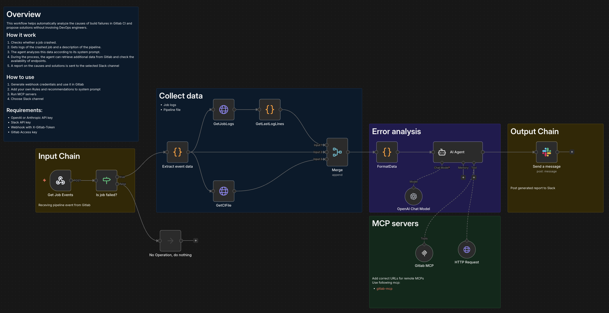

# Overview

This workflow helps automatically analyze the causes of build failures in Gitlab CI and propose solutions without involving DevOps engineers.

## How it work
1. Checks whether a job crashed.
1. Gets logs of the crashed job and a description of the pipeline.
1. The agent analyzes this data according to its system prompt.
1. During the process, the agent can retrieve additional data from Gitlab and check the availability of endpoints.
1. A report on the causes and solutions is sent to the selected Slack channel 

## How to use
1. Generate webhook credentials and use it in Gitlab
1. Add your own Rules and recommendations to system prompt
1. Run MCP servers
1. Choose Slack channel

## Requirements:
- OpenAI  or Anthropic API key
- Slack API key
- Webhook with X-Gitlab-Token 
- Gitlab Access key
