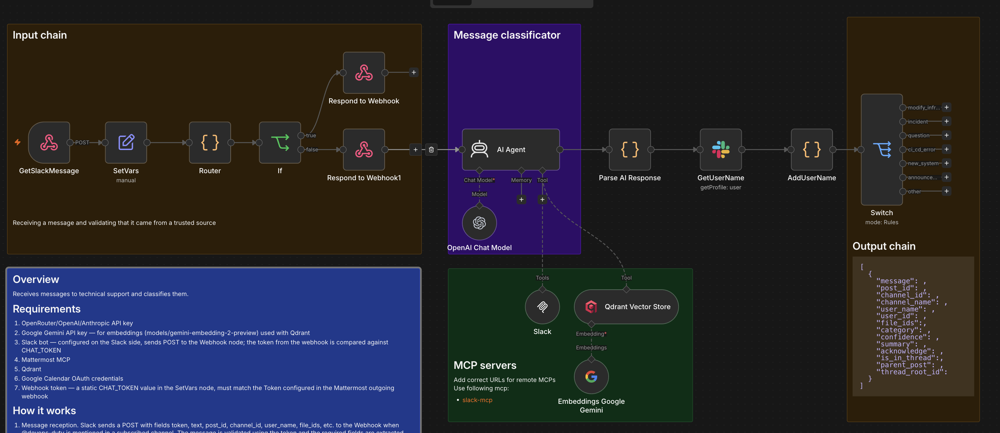
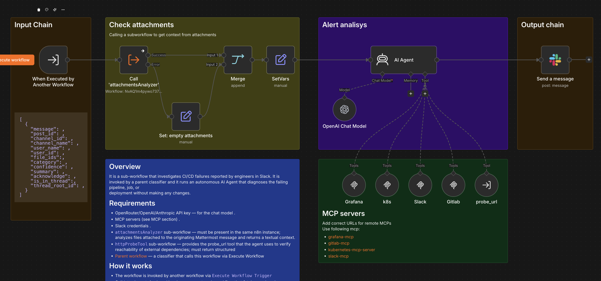
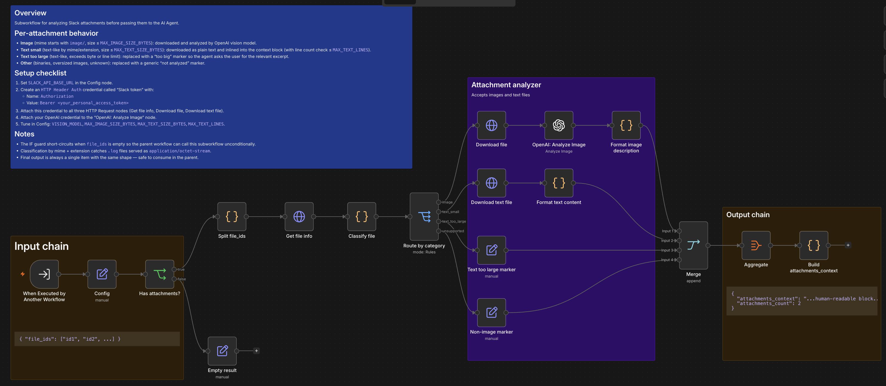
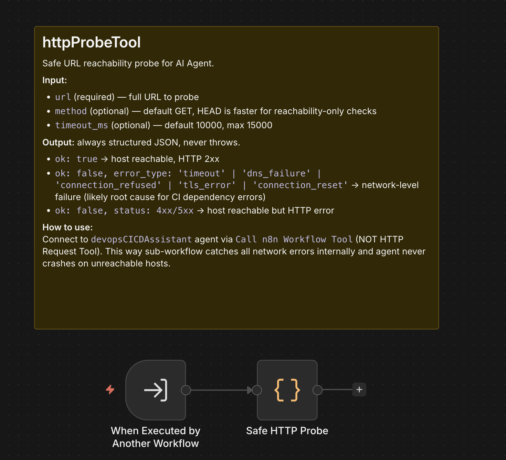

# Overview
A set of workflows that solves the problem of technical support in Slack

## Initial workflow

Receives messages to technical support through Slack and classifies them.

## Sub Workflows
A list of subworkflows, each of which handles a specific type of request. They connect to parent workflow using `Execute Sub-workflow` node.

### CICDAssistant

It is a sub-workflow that investigates CI/CD failures reported by engineers in Slack. It is invoked by a parent classifier and it runs an autonomous AI Agent that diagnoses the failing pipeline, job, or
deployment without making any changes.

## Auxiliary workflows
List of service subworkflows that are used in the main subworkflows

### attachmentsAnalizer

Subworkflow for analyzing Slack attachments.

### httpProbeTool

### ErrorReporter

