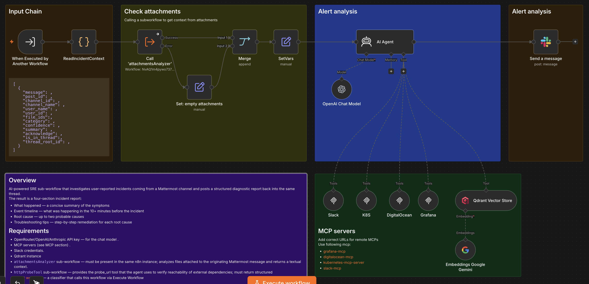
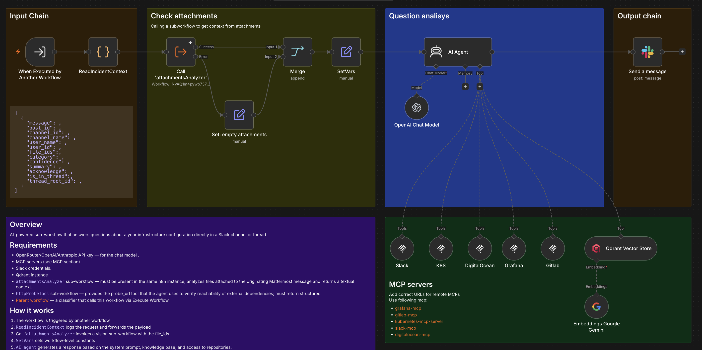
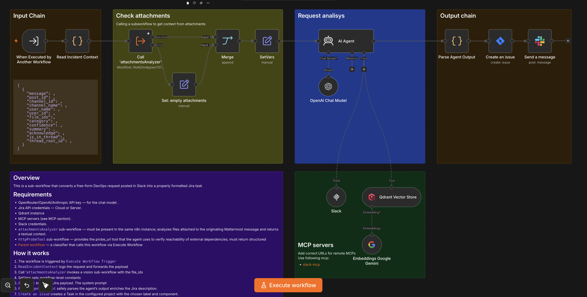

# Overview
A set of workflows that solves the problem of technical support in Slack

## Initial workflow

Receives messages to technical support through Slack and classifies them.

## Sub Workflows
A list of subworkflows, each of which handles a specific type of request. They connect to parent workflow using `Execute Sub-workflow` node.

### CICDAssistant

It is a sub-workflow that investigates CI/CD failures reported by engineers in Slack. It is invoked by a parent classifier and it runs an autonomous AI Agent that diagnoses the failing pipeline, job, or
deployment without making any changes.

### IncidentAssistant

AI-powered SRE sub-workflow that investigates user-reported incidents coming from a Mattermost channel and posts a structured diagnostic report back into the same thread.
The result is a four-section incident report:
* What happened — a concise summary of the symptoms
* Event timeline — what was happening in the 10+ minutes before the incident
* Root cause — up to two probable causes
* Troubleshooting tips — step-by-step remediation for each root cause

### QuestionsAssistant

AI-powered sub-workflow that answers questions about a your infrastructure configuration directly in a Mattermost channel or thread

### TaskAssistant

This is a sub-workflow that converts a free-form DevOps request posted in Mattermost into a properly formatted Jira task 

## Auxiliary workflows
List of service subworkflows that are used in the main subworkflows

### attachmentsAnalizer

Subworkflow for analyzing Slack attachments.

### httpProbeTool

### ErrorReporter

